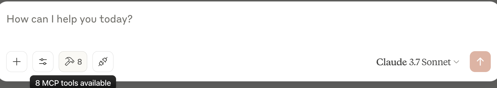
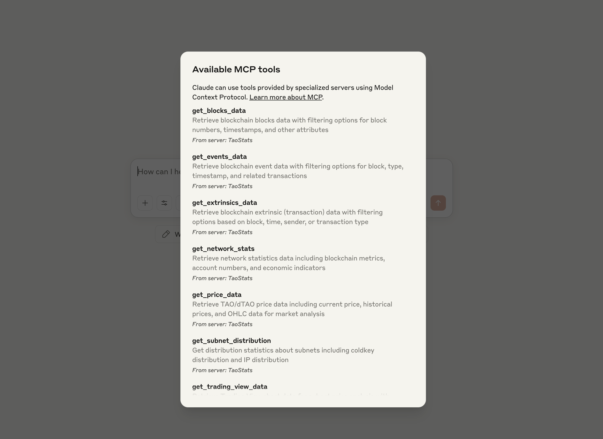
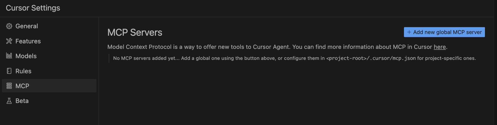
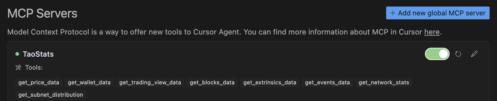
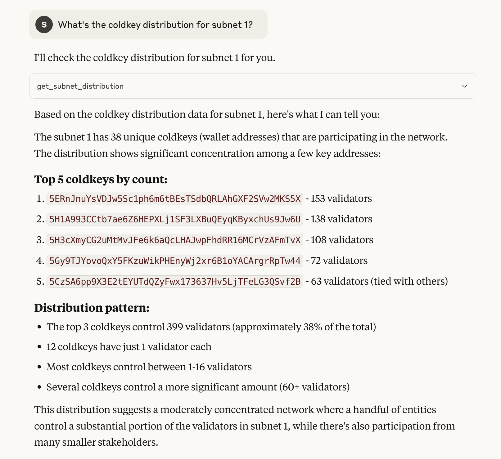
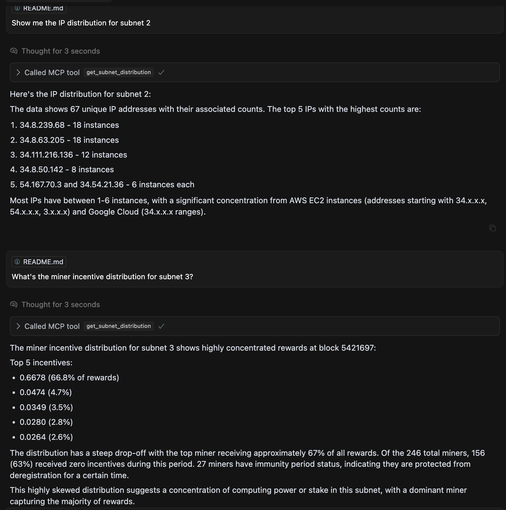

# TaoStats MCP

Using TaoStats MCP with Claude Desktop or Cursor

## Features

* 📊 Access real-time **TAO price data** including current, historical, and OHLC charts
* 👛 Query **wallet and account data** including balances, transaction history, and transfers
* 📈 Retrieve **TradingView chart data** for subnet price analysis with customizable time ranges
* 🔍 Explore **blockchain data** with powerful filtering options for blocks, extrinsics, and events 
* 📡 Access **network statistics** including metrics, account numbers, and economic indicators
* 🌐 Analyze **subnet distribution** data for coldkeys, IPs, and miner incentives

## Prerequisites

* Python 3.11 or higher
* `uv` package manager
* A valid TaoStats API key
* Install Claude Desktop or Cursor

**Install UV package manager:**

```bash
curl -LsSf https://astral.sh/uv/install.sh | sh
```
or
```bash
pip3 install uv
```

## Server Setup Instructions

This step is **required for both Claude Desktop and Cursor** — the server is what enables access to the TaoStats tools.

**1. Clone the Repo and Navigate to your project directory**

```bash
git clone https://github.com/0xmsu/endgame-mcp-hackathon
cd endgame-mcp-hackathon
```

**2. Create and activate a virtual environment**

```bash
uv venv
source .venv/bin/activate
```

**3. Initialize the project directory**

```bash
uv sync
```

**4. Get your TaoStats API key**

Sign up at [TaoStats](https://taostats.io/) and get your API key from your account settings.

**5. Test your MCP server**

While it's not required to run the server continuously, performing a quick test ensures that your setup is correct.

To test your server, execute the following command:

```bash
uv run mcp run src/server.py
```

This command starts the server and waits for connections. Once you've confirmed it's running correctly, you can stop it by pressing `Ctrl+C`.


To use MCP-Inspector 
```bash
uv run mcp dev src/server.py
```


After this verification, you don't need to run the server manually. As long as the necessary files are present on your local machine, your MCP client (such as Claude Desktop or Cursor) will handle starting the server as needed.

**6. Get the full path to your `uv` executable:**

```bash
which uv
```

## Configure Claude Desktop

**Run the following command, this will open your Claude configuration file**

```bash
code ~/Library/Application\ Support/Claude/claude_desktop_config.json
```

**Update with this:**

```json
{
    "mcpServers": {
        "taostats": {
            "command": "FULL_PATH_TO_UV",  // Replace with output from `which uv`
            "args": [
                "--directory",
                "/path/to/endgame-mcp-hackathon",  // Replace with the path to your local clone
                "run",
                "src/server.py"
            ],
            "env": {
                "TAOSTATS_API_KEY": "your-taostats-api-key"  // Replace with your actual API key
            }
        }
    }
}
```

Replace "FULL_PATH_TO_UV" with the full path you got from `which uv`.

For instance:
```
/Users/username/.local/bin/uv
```

**Open Claude desktop**

**Look for the hammer icon — this confirms your MCP server is running. You'll now see TaoStats tools available inside Claude.**




## Configure Cursor

You can either update the config file manually or use the built-in UI.

* Go to **Cursor Settings**
* Navigate to your Cursor settings and select `add new global MCP server`





**Use Agent Mode**

In Cursor, make sure you're using **Agent Mode** in the chat. Agents have the ability to use any MCP tool — including TaoStats tools. You can ask it questions like:


## Example Queries

Try asking these questions to test your TaoStats MCP integration:

### Price Data
```
"What is the current TAO price?"
"Show me TAO price history for the last 30 days"
"Get OHLC price data for TAO with 1-day periods"
```

### Wallet & Account Data
```
"Show me account details for 5Hd2ze5ug8n1bo3UCAcQsf66VNjKqGos8u6apNfzcU86pg4N"
"Get recent transfers for address 5ESDyJBqh3SRcmboQpHc3761pZqV5C9vrFPFy8qxtAzerktB"
"Show me the list of known exchanges"
```

### Blockchain Data
```
"Show me the latest blocks on the Bittensor network"
"Get details for extrinsic ID 5416952-0028"
"What events happened in block 5416968?"
```

### Network Statistics
```
"What are the current network statistics for Bittensor?"
"Show me historical network stats for the past month"
"What's the current subnet registration cost?"
```

### Subnet Distribution
```
"What's the coldkey distribution for subnet 1?"
"Show me the IP distribution for subnet 2"
"What's the miner incentive distribution for subnet 3?"
```



## Tool Usage in Action

When the agent responds, you'll see it indicate which **MCP tool** it's using, along with a coherent and context-aware reply.



## Troubleshooting

If you encounter any issues:

1. **API Key issues**: Verify your TAOSTATS_API_KEY is correctly set in the configuration.
   Error message: "API KEY NOT FOUND! Set TAOSTATS_API_KEY environment variable."

2. **Connection errors**: Check your internet connection and the TaoStats API status.
   Error message: "Request timeout" or "HTTP error"

3. **Missing dependencies**: Make sure all required packages are installed.
   ```bash
   uv add "mcp[cli]" httpx pydantic
   ```

4. **MCP server not detected**: Ensure the path to your repository is correct in the configuration file.

5. **Wrong UV path**: Verify the full path to UV with `which uv` and update your configuration.

6. **Tools not appearing**: Restart Claude Desktop or Cursor after configuration.

For any additional help, please visit the [TaoStats documentation](https://taostats.io/docs) or create an issue on the GitHub repository.
